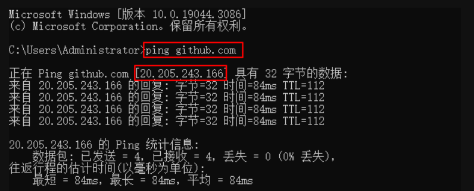
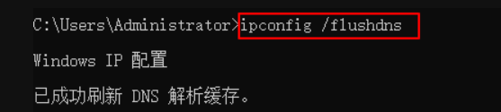

# 登录GitHub解决方案
问题：访问github官网经常面临打不开或访问极慢的问题，经常使用体验极差，那有什么好办法解决github官网访问不了的问题？
## 原因
首先我们说下github官网打不开的原因到底是什么。我们会发现，github有时可以打开，有时打不开，能不能打开似乎全靠运气，其实这都是因为你访问github官网时是直接访问域名即github.com，那么中间有个域名通过DNS解析的过程，将域名解析为对应的ip地址，其实主要时间都是花在了DNS解析上，导致了github有时候能打开，有时候打不开，有时候访问很慢。
## 解决方案
* 1、Windows系统打开cmd（长按windows键，点击R，输入cmd，点击确定即可打开），Mac系统打开终端：输入下列命令得到github的ip地址（第二个红色标记）：

* 2、Ctrl+C复制下来，打开电脑的  **C:\Windows\System32\drivers\etc**
路径（Mac系统自行百度一下hosts文件的位置），找到hosts文件，用记事本（记事本用管理员方式打开）打开，在最下面的空行粘贴ip地址，并加上github域名（注意ip和域名之间有空格），如下：
  ```
    20.205.243.166 github.com
  ```
* 3、Ctrl+S保存文件，即可成功
**PS：这时候应该已经成功了，打开github应该已经变得飞快了，如果你还是打不开github或速度没有任何提升，需要继续往下看**
* 4、再次打开终端输入以下命令刷新DNS缓存
  ```
    ipconfig /flushdns
  ```
  
* 5、以后再打开github就会飞快了，大功告成！

————————————————
版权声明：本文为CSDN博主「前端吕小布」的原创文章，遵循CC 4.0 BY-SA版权协议，转载请附上原文出处链接及本声明。
原文链接：https://blog.csdn.net/weixin_43804496/article/details/131475204/

